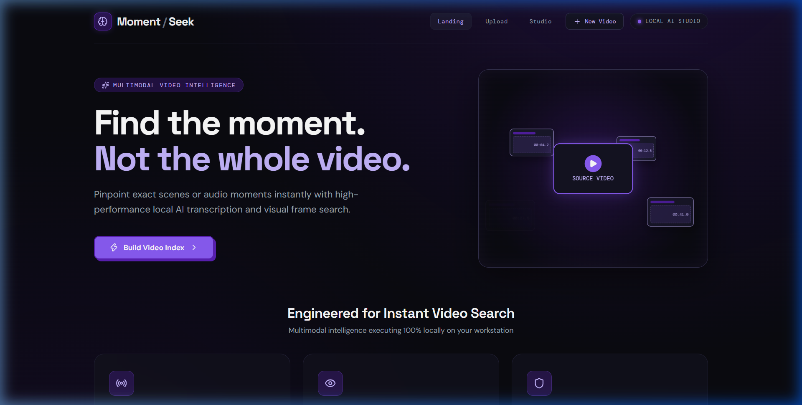
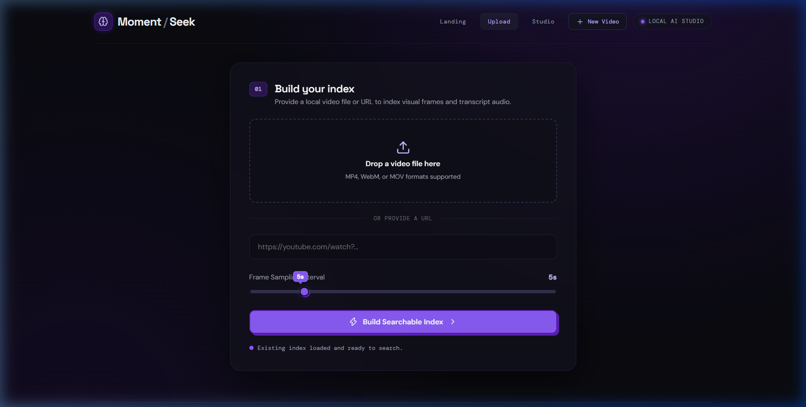
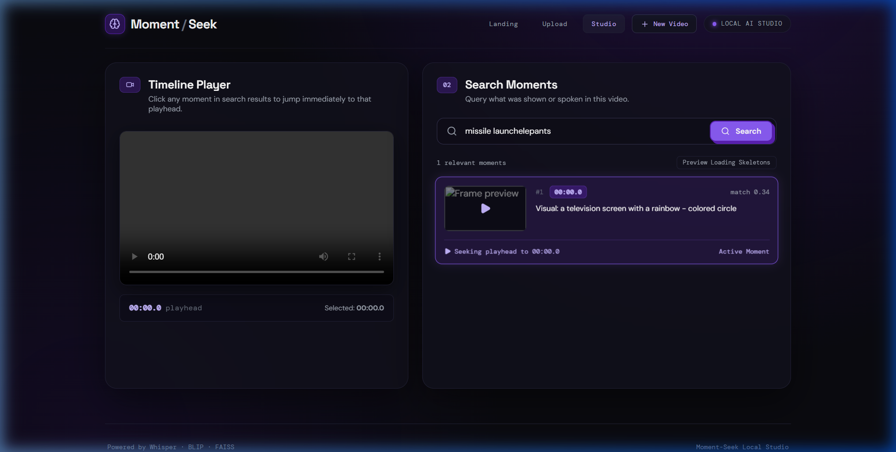
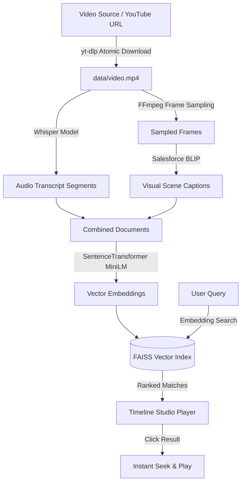

# Moment-Seek 🎬🔍

> **Find the moment. Not the whole video.**

[](https://www.python.org/)
[](https://fastapi.tiangolo.com/)
[](https://reactjs.org/)
[](https://vitejs.dev/)
[](https://github.com/openai/whisper)
[](https://huggingface.co/Salesforce/blip-image-captioning-base)
[](https://github.com/facebookresearch/faiss)
[](LICENSE)

**Moment-Seek** is a high-performance local AI video intelligence workspace. It turns long-form video files into an instantly searchable timeline by combining speech-to-text audio transcription (**Whisper**) and visual frame captioning (**BLIP**) powered by dense vector search (**FAISS**).

---

## 🌟 Interface Showcase

### 1. Landing Page
*Bold agency-inspired interface featuring a custom CSS "ejecting frames" hero animation and feature highlights.*



---

### 2. Upload & Indexing View
*Streamlined video ingestion supporting local file drag & drop or direct YouTube URL processing with custom frame sampling.*



---

### 3. Interactive Timeline Studio
*Search multimodal moments and jump instantly to matching video timestamps with seek-on-click controls.*



---

## ✨ Key Features

- **🎙️ Audio & Speech Search**: Transcribe spoken dialogue with OpenAI Whisper into precise timestamped audio segments.
- **👁️ Visual & Scene Search**: Sample video frames at configurable intervals and generate natural language visual captions with Salesforce BLIP.
- **⚡ Instant Seek-on-Click**: Click any matching result card to seek the timeline video player playhead instantly to that scene.
- **🔒 100% Local & Private**: All vector embeddings, AI models, and video data remain entirely on your local machine with zero external cloud API dependencies.
- **🎨 Premium Agency Aesthetics**: Built with a sleek dark purple/black identity, 3D button interactions, custom sliders, blurred skeleton loaders, and GPU-accelerated CSS animations.
- **🔄 Robust Ingestion**: Atomic temporary downloads with automatic video/audio stream merging and `moov` atom validation.

---

## 🏗️ Architecture & Pipeline



---

## 🚀 Quick Start

### Prerequisites

- **Python**: 3.10 or higher
- **Node.js**: 18.0 or higher
- **FFmpeg**: Installed and available on your system `PATH` (or set `FFMPEG_PATH`)

---

### 1. Backend Setup

Clone the repository and create a Python virtual environment:

```bash
git clone https://github.com/PritamMishra065/moment-seek.git
cd moment-seek

# Create and activate virtual environment
python -m venv venv

# Windows (PowerShell)
.\venv\Scripts\Activate.ps1

# Linux / macOS
source venv/bin/activate

# Install Python dependencies
pip install -r requirements.txt
```

---

### 2. Frontend Setup

In a new terminal window, navigate to the `web` directory and install Node dependencies:

```bash
cd moment-seek/web
npm install
```

---

### 3. Running the Application

#### Step A: Start the FastAPI Backend (Port 8001)

```bash
# From project root directory
python -m uvicorn api:app --reload --port 8001
```

#### Step B: Start the React Frontend (Port 5173)

```bash
# From web directory
cd web
npm run dev
```

Open your browser to **[http://localhost:5173](http://localhost:5173)** to access the studio workspace.

---

## 💻 Command Line Interface (CLI)

You can also run the video processing and search pipeline directly from the CLI:

### Process a Local Video

```bash
python app.py --video path/to/video.mp4 --query "person talking about space" --interval 3.0
```

### Process a YouTube URL

```bash
python app.py --url "https://www.youtube.com/watch?v=aqz-KE-bpKQ" --query "elephant" --interval 5.0
```

---

## 📡 API Reference

The FastAPI backend exposes the following REST endpoints on `http://localhost:8001`:

| Endpoint | Method | Description |
| :--- | :--- | :--- |
| `/api/health` | `GET` | Returns readiness status of current video index and dataset. |
| `/api/process` | `POST` | Ingests a local file upload or YouTube URL and starts background processing. |
| `/api/status/{task_id}` | `GET` | Returns progress stage and status of an active indexing task. |
| `/api/search?q={query}&top_k=6` | `GET` | Queries FAISS index for relevant timestamped audio and frame moments. |
| `/media/video.mp4` | `GET` | Static file handler serving the active video file to the frontend player. |

---

## 📁 Project Structure

```text
moment-seek/
├── api.py               # FastAPI server endpoints & async background worker
├── app.py               # Multimodal pipeline (FFmpeg, Whisper, BLIP, FAISS)
├── requirements.txt     # Python dependencies
├── docs/
│   └── images/          # Screenshots for README showcase
│       ├── landing_page.png
│       ├── upload_view.png
│       └── studio_view.png
└── web/                 # React + Vite frontend application
    ├── index.html
    ├── package.json
    ├── vite.config.js
    └── src/
        ├── main.jsx     # Main React application & view navigation
        └── styles.css   # Dark purple design system, 3D buttons & keyframes
```

---

## 📜 License

This project is open source and available under the [MIT License](LICENSE).
